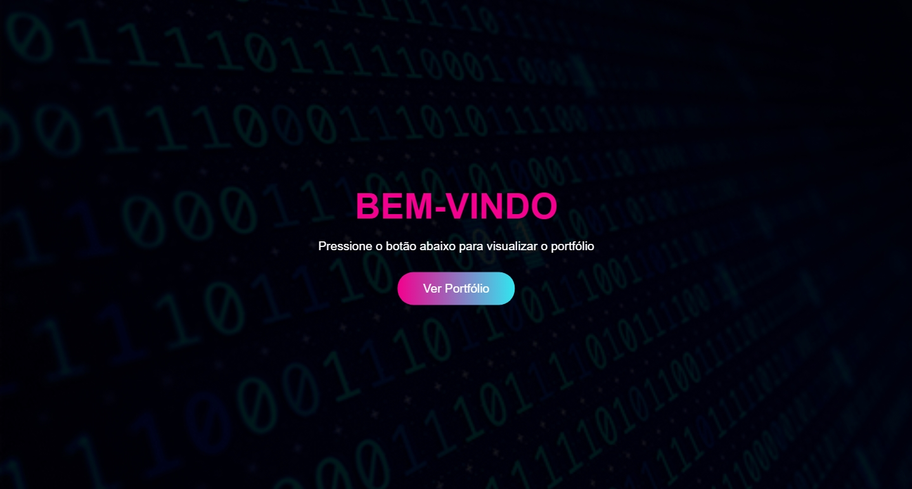
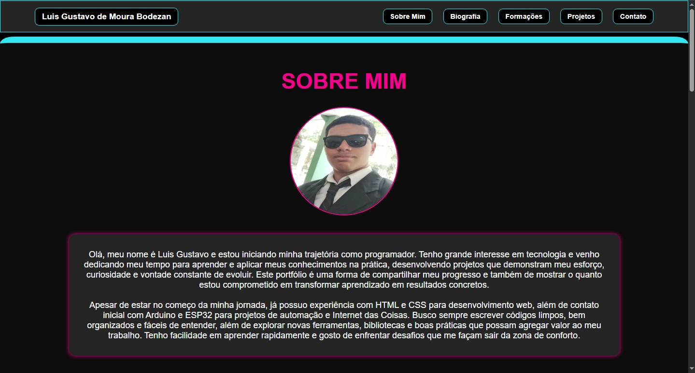
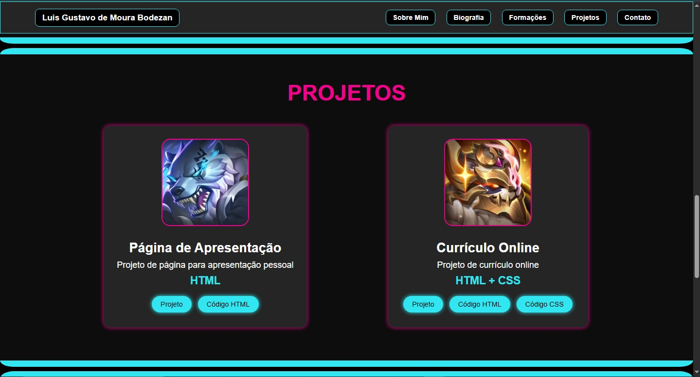
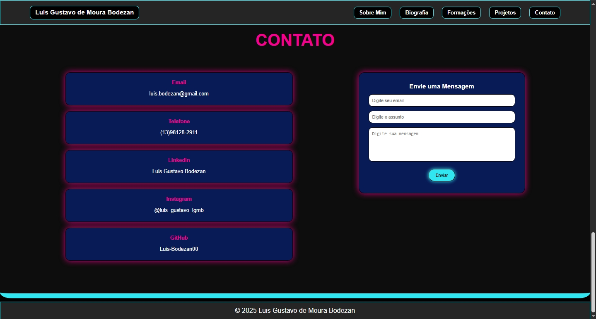

# 📁 Portfólio Pessoal – Parte 1

Este é meu projeto de **Portfólio P1**, desenvolvido no segundo semestre do curso **Engenharia da Computação** na disciplina **Tecnologia Web**.  

O objetivo é aplicar os conhecimentos adquiridos em **HTML**, **CSS** e **Flexbox**, criando um site pessoal moderno, responsivo e que possa servir como apresentação para oportunidades futuras.

---

## 📌 Sobre o Projeto

O portfólio é dividido em duas páginas principais:  

1. **Página Inicial** – com o título e botão de acesso à página principal.  
2. **Página Portfólio** – apresenta minhas informações pessoais, formações, projetos desenvolvidos e formas de contato.  

---

## 🧪 Funcionalidades

- **Página Inicial** – Título e botão de acesso ao portfólio.  
- **Página Portfólio** – Seções principais:  
  - **Sobre Mim** – Apresentação com imagem de perfil.  
  - **Biografia** – Breve trajetória pessoal e acadêmica.  
  - **Formações** – Minhas formações educacionais.  
  - **Projetos** – Cards com links para projetos realizados.  
  - **Contato** – Links para redes sociais e formulário de contato.  
- **Layout Responsivo** – Adaptável para desktop e dispositivos móveis.  

---

## 🧰 Recursos Utilizados

- HTML5  
- CSS3 + Flexbox  
- Google Fonts  
- Font Awesome (ícones)  
- Paleta de cores personalizada  
- Imagens próprias  

---

## 🎨 Protótipo

O protótipo foi desenvolvido no **Canva**:  

[🔗 Ver Protótipo](https://www.canva.com/design/DAGzXrReUfU/gsEdr1M1WGndluAL5hCevw/edit?utm_content=DAGzXrReUfU&utm_campaign=designshare&utm_medium=link2&utm_source=sharebutton)

---

## 🔗 Como Visualizar o Projeto

- Baixe/clonar este repositório e abra o arquivo `index.html` no navegador.  
- Ou acesse diretamente pelo **GitHub Pages**:  
  👉 [Clique aqui para abrir o site](https://luisbodezan.github.io/Portfolio_Parte1/)  

---

## 📸 Capturas de Tela

  
  
  
  
---

## 📄 Licença

Este projeto foi desenvolvido para **fins educacionais** como parte da disciplina **Tecnologia Web**.

---

## 🙋 Autor

**Luis Gustavo de Moura Bodezan – RA: 248054**  
Curso: Engenharia da Computação – Turma A  
Email: (luis.bodezan@gmail.com)  
GitHub: 👉 [Clique aqui](hhttps://github.com/LuisBodezan)  
LinkedIn: 👉 [Clique aqui](https://www.linkedin.com/in/luis-gustavo-bodezan-11aa68347)  
